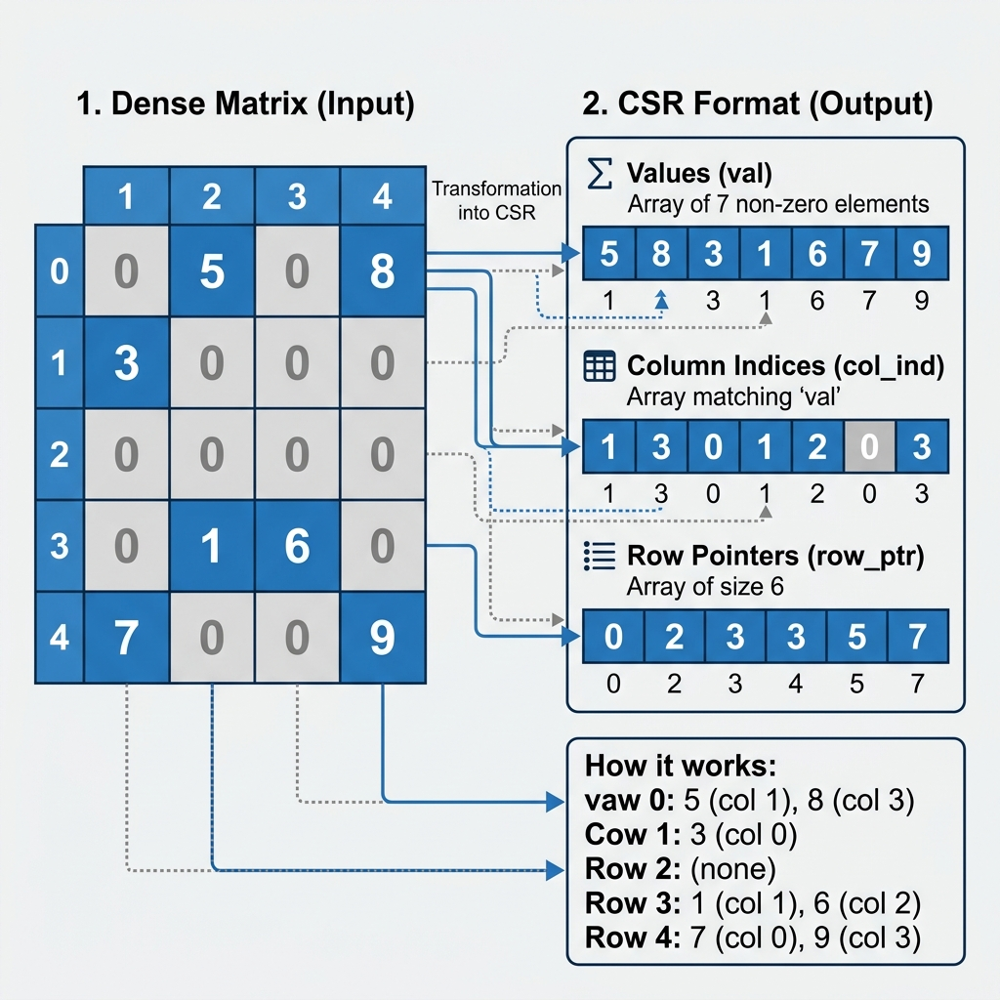

# RV-Sparse CSR Kernel

## Sparse Matrix Vector Multiplication using CSR Representation

### Overview
In scientific computing and AI, dense matrices waste significant memory and computational resources because they store and multiply by zero. Sparse matrices improve efficiency by tracking only non-zero elements.

This project implements a highly optimized **Sparse Matrix-Vector Multiplication (SpMV)** kernel using the **Compressed Sparse Row (CSR)** representation. By avoiding zeros, CSR dramatically improves cache locality and traversal speed.



```text
Dense Matrix
      ↓
CSR Extraction
      ↓
values[] + col_idx[] + row_ptr[]
      ↓
Sparse Matrix Vector Multiply
      ↓
Output Vector
```

### Features
- **Zero dynamic memory allocation**: All CSR buffers are caller-provided, enabling deterministic memory behavior suitable for embedded and accelerator-oriented systems.
- **CSR extraction**: Scans a configurable multi-dimensional array to generate sparse layouts dynamically.
- **Sparse matrix-vector multiplication**: Calculates results exclusively on non-zero entries.
- **Cache-friendly traversal**: CSR traversal improves cache locality due to sequential memory access in `values[]` and `col_idx[]` arrays.
- **Modular implementation**: Broken into logical systems functions (`extract_csr`, `sparse_matvec`, `verify_result`).

### Build Instructions
A Makefile is included for rapid compilation:
```bash
make
./run
```

### Complexity Analysis
- **Dense matrix multiplication**: $O(\text{rows} \times \text{cols})$
- **CSR matrix multiplication**: $O(nnz)$

For matrices with high sparsity, this represents a massive reduction in operations. Check out the [Benchmark Notes](benchmark/benchmark_notes.md) and [Optimization Notes](docs/optimization_notes.md).

### Future Improvements
Future optimization work includes vectorizing sparse traversal loops using **RISC-V Vector (RVV) intrinsics** for improved throughput on RVV-enabled processors. Gathering loads and SIMD execution can natively map sparse dots to parallel hardware lanes. See [Future RVV Work](docs/future_rvv_work.md) for a deep dive.
